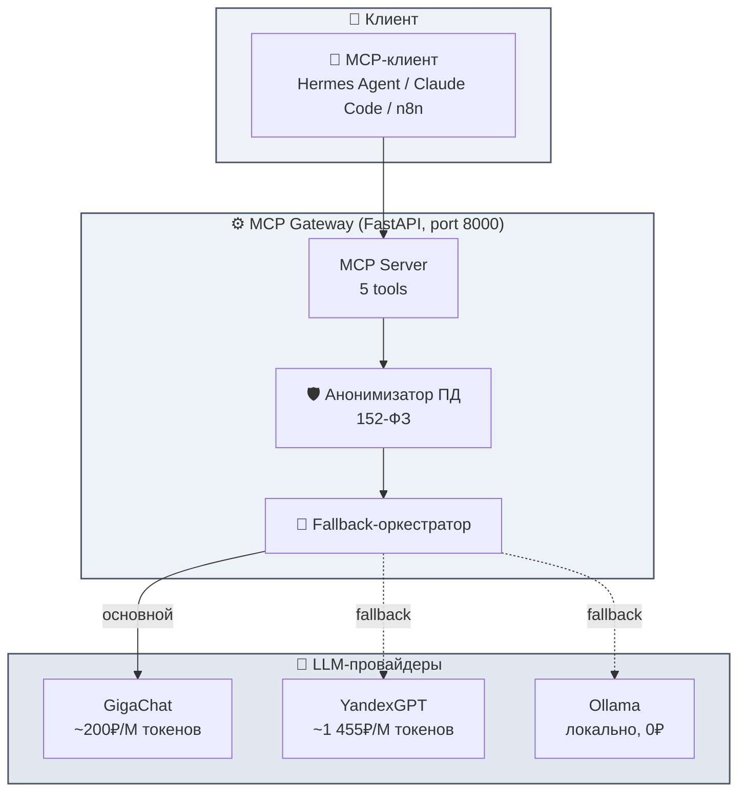

# MCP Gateway

<p align="center">
  
  
  
  
  
  
</p>

---

**MCP Gateway** — production-ready шлюз Model Context Protocol для российских LLM: единый интерфейс к GigaChat и YandexGPT с автоматическим fallback, анонимизацией ПД по 152-ФЗ и экономией 86% на токенах.

Подключите любой MCP-клиент (Hermes Agent, Claude Code, Cursor, n8n) — и получите доступ к российским моделям через один endpoint. Стек: FastAPI, MCP SDK, GigaChat API, YandexGPT API.

---

## ✨ Возможности

| Функция | Описание |
|---------|----------|
| **🔀 Мультипровайдерность** | GigaChat (основной) + YandexGPT (fallback) + Ollama (локальный) |
| **🛡️ 152-ФЗ** | Встроенная детекция и анонимизация ПД: телефон, ИНН, паспорт, СНИЛС, адрес |
| **💰 Экономия 86%** | GigaChat ~200₽/M токенов против YandexGPT ~1 455₽/M токенов |
| **🔄 Авто-fallback** | Бесшовное переключение провайдеров при ошибках и rate-limit (429) |
| **🐳 Docker Ready** | Полный Docker Compose для развёртывания одной командой |
| **💚 Health Checks** | Эндпоинты мониторинга и systemd-сервис с автозапуском |

---

## 🏗️ Архитектура



---

## 🚀 Быстрый старт

```bash
# Клонирование
git clone https://github.com/kvochkin-dev/mcp-gateway.git
cd mcp-gateway

# Настройка окружения
cp .env.example .env
# Впишите свои API-ключи в .env

# Запуск через Docker
docker-compose up -d

# Или напрямую
python -m venv venv && source venv/bin/activate
pip install -r requirements.txt
python app.py
```

---

## 📋 API Endpoints

| Метод | Путь | Описание |
|-------|------|----------|
| `GET` | `/health` | Статус сервиса и провайдеров |
| `GET` | `/docs` | Swagger UI |
| `POST` | `/mcp` | MCP-интерфейс (tools) |

### Health Check

```bash
curl http://localhost:8000/health
```

```json
{
  "status": "healthy",
  "gigachat": "connected",
  "yandexgpt": "connected",
  "anonymizer": "ready"
}
```

---

## 🔐 Конфигурация

Все секреты хранятся в `.env` (файл исключён из git):

```env
GIGACHAT_CLIENT_ID=***
GIGACHAT_CLIENT_SECRET=***
YANDEXGPT_API_KEY=***
YANDEXGPT_FOLDER_ID=***
```

---

## 🧪 Тесты

```bash
pytest tests/ -v
```

**13/13 тестов passed** — клиенты провайдеров, fallback-логика, анонимизатор ПД.

---

## 📁 Структура проекта

```
mcp-gateway/
├── app.py                  # FastAPI + MCP сервер
├── src/
│   ├── clients/            # GigaChat, YandexGPT клиенты
│   └── anonymizer/         # 152-ФЗ анонимизация ПД
├── scripts/
│   └── mcp-monitor.sh      # Мониторинг сервисов
├── docs/                   # Отчёты и документация
├── tests/                  # 13 тестов
└── docker-compose.yml      # Docker-развёртывание
```

---

## 📄 Лицензия

MIT — используйте свободно.

---

<p align="center">
  Сделано в opencode, работает в проде. 🧿
</p>
